<picture>
  <source media="(prefers-color-scheme: dark)" srcset="./dist/dark.svg">
  <source media="(prefers-color-scheme: light)" srcset="./dist/light.svg">
  
</picture>

 

 
 

 

---

## Executive Summary

I’m **fardad Arman**, a full-stack developer building clean, scalable, and visually refined web products.

My work sits between **backend engineering**, **CMS architecture**, and **frontend experience design**. I enjoy creating systems that are not only functional, but also structured, maintainable, and pleasant to use.

I mainly work with **Django**, **WordPress**, **Tailwind CSS**, **JavaScript**, databases, dashboards, automation flows, and custom web platforms.

 

<table>
  <tr>
    <td width="50%">
      <h3>Engineering Focus</h3>
      <ul>
        <li>Django applications and business dashboards</li>
        <li>Custom WordPress themes and plugins</li>
        <li>Database-driven platforms and admin systems</li>
        <li>Clean backend logic and scalable structure</li>
      </ul>
    </td>
    <td width="50%">
      <h3>Product Focus</h3>
      <ul>
        <li>Modern responsive interfaces</li>
        <li>Performance-aware frontend implementation</li>
        <li>UI consistency and visual clarity</li>
        <li>Better workflows for real users and businesses</li>
      </ul>
    </td>
  </tr>
</table>

---

## Core Technologies

 

---

## Premium Development Services

<table>
  <tr>
    <td width="33%">
      <h3>01. Django Systems</h3>
      

        Backend platforms, CRMs, dashboards, APIs, business workflows, admin panels,
        authentication systems, reporting features, and database-driven products.
      

    </td>
    <td width="33%">
      <h3>02. WordPress Engineering</h3>
      

        Custom themes, plugin development, Gutenberg-ready layouts, optimized CMS architecture,
        performance improvements, and flexible content management systems.
      

    </td>
    <td width="33%">
      <h3>03. Frontend Experience</h3>
      

        Responsive layouts, Tailwind design systems, interaction polish, clean UI implementation,
        and user-focused product interfaces.
      

    </td>
  </tr>
</table>

---

## Featured Work

<table>
  <tr>
    <td width="50%">
      <h3>Django CRM Platform</h3>
      

        A modular business management platform built with Django and relational database architecture.
      

      <ul>
        <li>Customer and workflow management</li>
        <li>Admin dashboard and reporting</li>
        <li>Scalable application structure</li>
        <li>Business automation foundations</li>
      </ul>
      

        
        
        
      

    </td>
    <td width="50%">
      <h3>Custom WordPress Theme</h3>
      

        A performance-focused WordPress theme designed for clean content management and polished presentation.
      

      <ul>
        <li>Custom templates and components</li>
        <li>Gutenberg-compatible structure</li>
        <li>SEO-aware semantic markup</li>
        <li>Optimized theme assets</li>
      </ul>
      

        
        
        
      

    </td>
  </tr>
  <tr>
    <td width="50%">
      <h3>E-Commerce Experience</h3>
      

        A modern storefront concept focused on product clarity, conversion flow, and fast interface design.
      

      <ul>
        <li>Responsive shopping interface</li>
        <li>Checkout-ready architecture</li>
        <li>Dynamic product and pricing logic</li>
        <li>Clean Tailwind-based UI</li>
      </ul>
      

        
        
        
      

    </td>
    <td width="50%">
      <h3>Creative Data Interface</h3>
      

        An experimental direction focused on combining data visualization, interaction, and product storytelling.
      

      <ul>
        <li>Visual-first dashboard concepts</li>
        <li>Interactive reporting components</li>
        <li>Graphical data representation</li>
        <li>Clean technical storytelling</li>
      </ul>
      

        
        
        
      

    </td>
  </tr>
</table>

---

## GitHub Analytics

 

## ⚡ Capability Matrix

<table width="100%">
<tr>
<td align="right"><b>Django Backend</b></td>
<td></td>
<td><code>92%</code></td>
</tr>
<tr>
<td align="right"><b>WordPress Development</b></td>
<td></td>
<td><code>88%</code></td>
</tr>
<tr>
<td align="right"><b>Product Thinking</b></td>
<td></td>
<td><code>86%</code></td>
</tr>
<tr>
<td align="right"><b>Database Design</b></td>
<td></td>
<td><code>84%</code></td>
</tr>
<tr>
<td align="right"><b>UI Implementation</b></td>
<td></td>
<td><code>81%</code></td>
</tr>
<tr>
<td align="right"><b>Tailwind CSS</b></td>
<td></td>
<td><code>80%</code></td>
</tr>
<tr>
<td align="right"><b>JavaScript</b></td>
<td></td>
<td><code>72%</code></td>
</tr>
</table>

## My Engineering Principles

<table>
  <tr>
<td width="25%">
<h3>Clarity</h3>

Code, UI, and structure should be understandable without unnecessary complexity.

</td>
<td width="25%">
<h3>Performance</h3>

Fast interfaces and optimized systems create better product experiences.

</td>
<td width="25%">
<h3>Scalability</h3>

Projects should be built to grow without turning into fragile codebases.

</td>
<td width="25%">
<h3>Polish</h3>

Details matter. Strong products feel intentional in both code and design.

</td>
  </tr>
</table>

---

## Current Roadmap

<table>
  <tr>
<th align="left">Track</th>
<th align="left">Current Focus</th>
<th align="left">Goal</th>
  </tr>
  <tr>
<td><strong>Django</strong></td>
<td>APIs, dashboards, admin systems, clean service structure</td>
<td>Build stronger business platforms and internal tools</td>
  </tr>
  <tr>
<td><strong>WordPress</strong></td>
<td>Plugin architecture, Gutenberg blocks, advanced customization</td>
<td>Create flexible and automation-friendly CMS solutions</td>
  </tr>
  <tr>
<td><strong>Frontend</strong></td>
<td>Tailwind systems, responsive layouts, interaction polish</td>
<td>Deliver premium visual experiences with clean implementation</td>
  </tr>
  <tr>
<td><strong>Creative Development</strong></td>
<td>Data visualization, graphical interfaces, product storytelling</td>
<td>Blend technical systems with strong visual communication</td>
  </tr>
</table>

---

## Contribution Snake

---

## Philosophy

> I believe great software should feel calm, clear, and capable.  
> Strong products are built where **engineering discipline**, **visual quality**, and **real user needs** meet.

---

## Connect With Me

 

