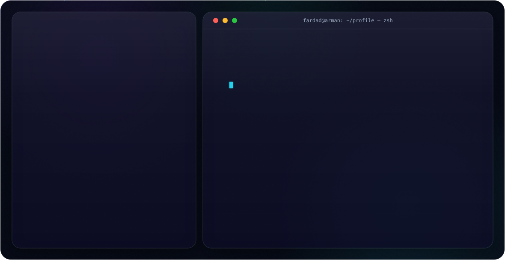

<!--
  Profile README
  Professional engineering profile for business owners, technical leaders, and developers.
-->

<picture>
  <source media="(prefers-color-scheme: dark)" srcset="./dist/dark.svg">
  <source media="(prefers-color-scheme: light)" srcset="./dist/light.svg">
  
</picture>

 

  

 

---

## ⚡ Engineering Snapshot

<table>
<tr>
<td align="center" width="25%">

**Business Logic**  
Models · Admin · APIs · Integrations

</td>
<td align="center" width="25%">

**CMS Engineering**  
Themes · Plugins · WooCommerce

</td>
<td align="center" width="25%">

**Frontend**  
Responsive UI · Interaction · Systems

</td>
<td align="center" width="25%">

**Engineering**  
Testing · Standards · Debugging

</td>
</tr>
</table>

 

## 👋 About Me

I’m **Fardad Arman**, a full-stack engineer focused on building **business-oriented web systems, administration platforms, CMS solutions, and polished user interfaces**.

My strongest areas are **Django/Python backend engineering**, **WordPress/PHP engineering**, **database-driven application architecture**, and **Tailwind-based frontend implementation**.

I care about the structure behind the interface: clear models, predictable workflows, maintainable code, reliable admin tools, testable behavior, and a development process that can survive future changes.

### What I Build

| Area | What I work on |
|---|---|
| **Business Platforms** | CRMs, dashboards, booking systems, workflow-driven applications and internal tools |
| **Django Engineering** | Models, admin systems, authentication, business logic, APIs, integrations and application architecture |
| **WordPress Engineering** | Custom themes, plugins, reusable components, CMS architecture and WooCommerce-oriented development |
| **Frontend Engineering** | Responsive interfaces, Tailwind CSS systems, HTML/CSS/JavaScript and interaction-focused UI |
| **Automation & Tooling** | Development scripts, build workflows, reusable project standards and operational tooling |
| **Product Engineering** | Turning business requirements into maintainable technical systems rather than isolated features |

---

## 🧭 Engineering Profile

<table width="100%">
<tr>
<td width="25%" align="center">

### Backend

**Django / Python**

Business logic, data models, admin platforms, authentication, integrations and application structure.

</td>
<td width="25%" align="center">

### CMS

**WordPress / PHP**

Themes, plugins, WooCommerce workflows, reusable components and CMS architecture.

</td>
<td width="25%" align="center">

### Frontend

**Tailwind / JavaScript**

Responsive interfaces, design systems, interaction details and production UI implementation.

</td>
<td width="25%" align="center">

### Engineering

**Git / Testing / Docs**

Version control, CI-oriented workflows, debugging, standards, documentation and quality gates.

</td>
</tr>
</table>

---

## 🛠️ Core Technologies

  

> **Primary stack:** Python · Django · PHP · WordPress · JavaScript · Tailwind CSS · SQL · Git/GitHub

---

## 🚀 Selected Engineering Work

| | Project | Engineering Scope |
|:---:|:---|:---|
| 🧱 | **[robo](https://github.com/mraliarman/robo)** | Django template builder · modular blocks · theme generation · admin workflows · CSS build · testing |
| ✂️ | **[barber](https://github.com/mraliarman/barber)** | Booking engine · calendar · services · appointment states · notifications · payment workflows |
| ⚙️ | **[tik](https://github.com/mraliarman/tik)** | Django conventions · auto registration · admin/model patterns · Tailwind build workflow |
| 📚 | **[wordpress-standard](https://github.com/mraliarman/wordpress-standard)** | PHP/WordPress standards · security · performance · Git · QA · release workflows |

 

## 🧩 How I Approach Engineering

<table width="100%">
<tr>
<td width="50%" valign="top">

### 01 — Understand the System

Before writing code, I try to understand:

- The business workflow
- The users and their actions
- Existing architecture
- Data relationships
- Constraints and edge cases

</td>
<td width="50%" valign="top">

### 02 — Design for Change

The goal is not merely to make today’s feature work.

I prefer structures that make the next feature, bug fix, integration or refactor easier to implement.

</td>
</tr>
<tr>
<td width="50%" valign="top">

### 03 — Make Quality Observable

Quality should be visible through:

- Tests
- Reviewable changes
- Clear naming
- Predictable structure
- Documentation
- Repeatable build and release steps

</td>
<td width="50%" valign="top">

### 04 — Polish the Product

A technically correct system is only part of the job.

I also care about responsive behavior, interaction details, consistency, accessibility-minded UI decisions and the clarity of the final workflow.

</td>
</tr>
</table>

---

## 🔐 Engineering Standards

My development workflow increasingly treats **security, maintainability and repeatability as engineering requirements**, not optional extras.

- Clear project and file structure
- Small, reviewable changes
- Explicit dependencies
- Secure handling of secrets and user input
- Database-aware application design
- Testable business logic
- CI and build validation where appropriate
- Documentation for important architectural decisions
- Git workflows that preserve a traceable development history

My public engineering standards are documented in:

**[<code>mraliarman/wordpress-standard</code>](https://github.com/mraliarman/wordpress-standard)**

---

## 📊 GitHub Activity

  

  

---

## 🐍 Contribution Activity

 

Every contribution represents another iteration of the engineering process.

---

## 🎯 Current Focus

| Track | Focus |
|---|---|
| **Django** | Business platforms, admin systems, application architecture, automation and integrations |
| **WordPress** | Plugin/theme engineering, reusable architecture, WooCommerce and CMS customization |
| **Frontend** | Tailwind CSS, responsive systems, interaction quality and design implementation |
| **Engineering Systems** | Standards, testing, CI, documentation and repeatable development workflows |
| **Product Engineering** | Building software around real business processes rather than isolated technical features |

---

## 📌 What Business Owners Can Expect

- **Business-first thinking:** technical decisions are connected to actual workflows and operational needs.
- **Maintainable systems:** the objective is not only delivery, but a codebase that can continue evolving.
- **Clear communication:** requirements, constraints and implementation decisions should remain understandable.
- **Attention to detail:** backend behavior and frontend experience are treated as parts of the same product.
- **Long-term ownership:** architecture, documentation, debugging and future changes matter alongside the initial release.

---

## 💬 Engineering Philosophy

> Great software should be **clear enough to understand, structured enough to evolve, and polished enough to trust**.
>
> I aim to build where **engineering discipline, product thinking, and visual quality** meet.

---

## 🤝 Connect With Me

 

